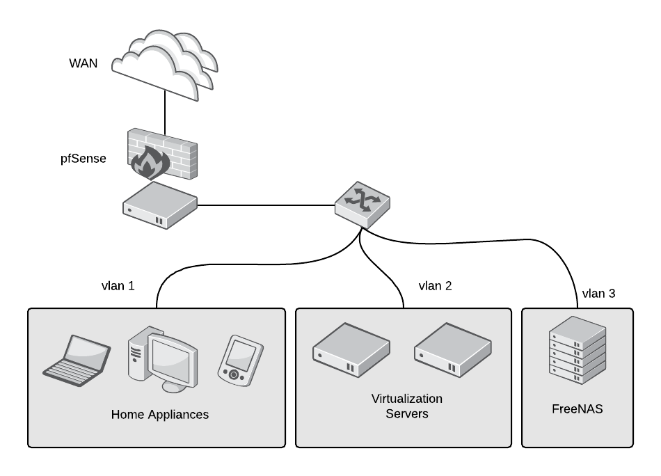

# How to build a homelab
Building a homelab can be a fun way to entertain yourself while learning new concepts and experimenting with new technologies.Thanks to the popularity of single-board computers (SBCs), it is easier than ever to build a multi-computer lab right from the comfort of your home. For instance, creating a "private cloud at home" is also a great way to get exposure to cloud-native technologies for considerably less money than trying to replicate the same setup with a major cloud provider.

Do you want to create a homelab? Maybe you want to experiment with different technologies, create development environments, or have your own private cloud. There are many reasons to have a homelab, and this guide aims to make it easier to get started.

There are three categories to consider when planning a home lab: hardware, software, and maintenance. We'll look at the first two categories here and save maintaining your computer lab for a future article.

# Hardware
When thinking about your hardware needs, first consider how you plan to use your lab as well as your budget, noise, space, and power usage.

If buying new hardware is too expensive, search local universities, ads, and websites like eBay or Craigslist for recycled servers. They are usually inexpensive, and server-grade hardware is built to last many years. You'll need three types of hardware: a virtualization server, storage, and a router/firewall.

## Virtualization servers
A virtualization server allows you to run several virtual machines that share the physical box's resources while maximizing and isolating resources. If you break one virtual machine, you won't have to rebuild the entire server, just the virtual one. If you want to do a test or try something without the risk of breaking your entire system, just spin up a new virtual machine and you're ready to go.

The two most important factors to consider in a virtualization server are the number and speed of its CPU cores and its memory. If there are not enough resources to share among all the virtual machines, they'll be overallocated and try to steal each other's CPU cycles and memory.

So, consider a CPU platform with multiple cores. You want to ensure the CPU supports virtualization instructions (VT-x for Intel and AMD-V for AMD). Examples of good consumer-grade processors that can handle virtualization are Intel i5 or i7 and AMD Ryzen. If you are considering server-grade hardware, the Xeon class for Intel and EPYC for AMD are good options. Memory can be expensive, especially the latest DDR4 SDRAM. When estimating memory requirements, factor at least 2GB for the host operating system's memory consumption.

If your electricity bill or noise is a concern, solutions like Intel's NUC devices provide a small form factor, low power usage, and reduced noise, but at the expense of expandability.

## Network-attached storage (NAS)
If you want a machine loaded with hard drives to store all your personal data, movies, pictures, etc. and provide storage for the virtualization server, network-attached storage (NAS) is what you want.

In most cases, you won't need a powerful CPU; in fact, many commercial NAS solutions use low-powered ARM CPUs. A motherboard that supports multiple SATA disks is a must. If your motherboard doesn't have enough ports, use a host bus adapter (HBA) SAS controller to add extras.

Network performance is critical for a NAS, so select a gigabit network interface (or better).

Memory requirements will differ based on your filesystem. ZFS is one of the most popular filesystems for NAS, and you'll need more memory to use features such as caching or deduplication. Error-correcting code (ECC) memory is your best bet to protect data from corruption (but make sure your motherboard supports it before you buy). Last, but not least, don't forget an uninterruptible power supply (UPS), because losing power can cause data corruption.

## Firewall and router
Have you ever realized that a cheap router/firewall is usually the main thing protecting your home network from the exterior world? These routers rarely receive timely security updates, if they receive any at all. Scared now? Well, you should be!

You usually don't need a powerful CPU or a great deal of memory to build your own router/firewall, unless you are handling a huge throughput or want to do CPU-intensive tasks, like a VPN server or traffic filtering. In such cases, you'll need a multicore CPU with AES-NI support. 

ou may want to get at least two 1-gigabit or better Ethernet network interface cards (NICs), also, not needed, but recommended, a managed switch to connect your DIY-router to create VLANs to further isolate and secure your network.

# Software
After you've selected your virtualization server, NAS, and firewall/router, the next step is exploring the different operating systems and software to maximize their benefits. While you could use a regular Linux distribution like CentOS, Debian, or Ubuntu, they usually take more time to configure and administer than the following options.

## Virtualization software
[**KVM**](https://www.linux-kvm.org/page/Main_Page) (Kernel-based Virtual Machine) lets you turn Linux into a hypervisor so you can run multiple virtual machines in the same box. The best thing is that KVM is part of Linux, and it is the go-to option for many enterprises and home users. If you are comfortable, you can install libvirt and virt-manager to manage your virtualization platform.

[**Proxmox VE**](https://www.proxmox.com/en/proxmox-ve) is a robust, enterprise-grade solution and a full open source virtualization and container platform. It is based on Debian and uses KVM as its hypervisor and LXC for containers. Proxmox offers a powerful web interface, an API, and can scale out to many clustered nodes, which is helpful because you'll never know when you'll run out of capacity in your lab.

[**oVirt (RHV)**](https://ovirt.org/) is another enterprise-grade solution that uses KVM as the hypervisor. Just because it's enterprise doesn't mean you can't use it at home. oVirt offers a powerful web interface and an API and can handle hundreds of nodes (if you are running that many servers, I don't want to be your neighbor!). The potential problem with oVirt for a home lab is that it requires a minimum set of nodes: You'll need one external storage, such as a NAS, and at least two additional virtualization nodes (you can run it just on one, but you'll run into problems in maintenance of your environment).

## NAS software
[**TrueNAS**](https://www.truenas.com/) (formely FreeNAS) is the most popular open source NAS distribution, and it's based on the rock-solid FreeBSD operating system. One of its most robust features is its use of the ZFS filesystem, which provides data-integrity checking, snapshots, replication, and multiple levels of redundancy (mirroring, striped mirrors, and striping). On top of that, everything is managed from the powerful and easy-to-use web interface. Before installing TrueNAS, check its hardware support, as it is not as wide as Linux-based distributions.

Another popular alternative is the Linux-based [**OpenMediaVault**](https://www.openmediavault.org/). One of its main features is its modularity, with plugins that extend and add features. Among its included features are a web-based administration interface; protocols like CIFS, SFTP, NFS, iSCSI; and volume management, including software RAID, quotas, access control lists (ACLs), and share management. Because it is Linux-based, it has extensive hardware support.

## Firewall/router software
[**pfSense**](https://www.pfsense.org/) is an open source, enterprise-grade FreeBSD-based router and firewall distribution. It can be installed directly on a server or even inside a virtual machine (to manage your virtual or physical networks and save space). It has many features and can be expanded using packages. It is managed entirely using the web interface, although it also has command-line access. It has all the features you would expect from a router and firewall, like DHCP and DNS, as well as more advanced features, such as intrusion detection (IDS) and intrusion prevention (IPS) systems. You can create multiple networks listening on different interfaces or using VLANs, and you can create a secure VPN server with a few clicks. pfSense uses pf, a stateful packet filter that was developed for the OpenBSD operating system using a syntax similar to IPFilter. Many companies and organizations use pfSense.

# Bibliography and sources
* [How to set up a homelab from hardware to firewall](https://opensource.com/article/19/3/home-lab)
* [Modify a disk image to create a Raspberry Pi-based homelab](https://opensource.com/article/20/5/disk-image-raspberry-pi)
